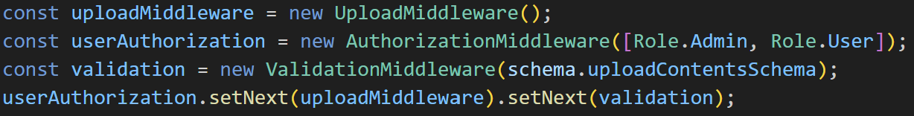
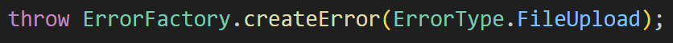
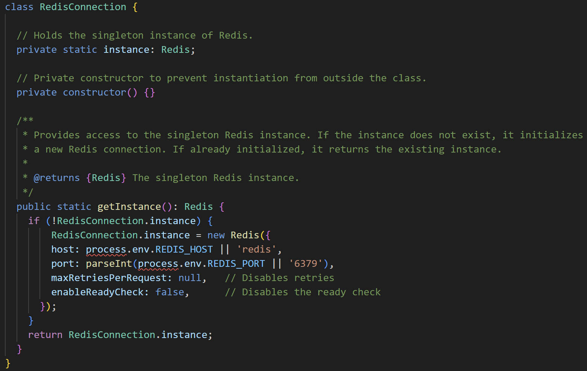
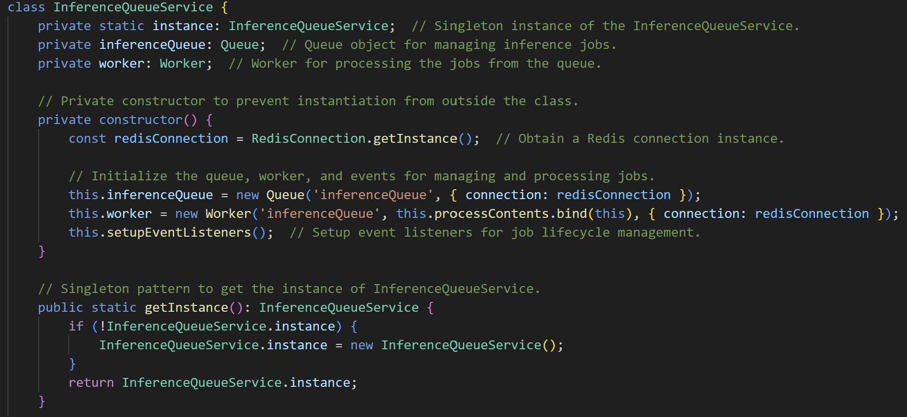

# Advanced Programming Project
*Backend Development for a Small Object Detection Model*

## Introduction

The objective of this project is to develop a backend for a Small Object Detection model written in Python. We utilized the _Express_ framework to abstract the backend calls to the model, which is built using the _Flask_ framework. This setup allows us to define various functionalities related to user management, inference processing using tokens, and the creation of customized datasets.

To achieve this, we used a _PostgreSQL_ database to ensure data persistence. Additionally, to handle potential concurrent requests, we leverage BullMQ, which uses _Redis_ for request queue management. Furthermore, we have implemented a websocket that provides real-time updates on the status of inferences that are either pending or currently being processed, once the user is connected and authenticated.

All components mentioned above, indicated in italics, have been encapsulated in custom Docker containers. The containers and their key operations are managed using Docker Compose.

---

## Installation

First of all you need to clone our GitHub repository:

```bash 
git clone https://github.com/leobordo/ProgPA
 ```
Alternatively, you can download the ZIP file directly from GitHub.

Next, you need to install the containers on your PC. For this step, you must have Docker installed (if you don’t have it, follow [these steps](https://docs.docker.com/engine/install/)).

 To start, you need to run Docker's engine:
  ```bash
sudo service docker start
   ```
Alternatively, you can use Docker Desktop, which is more user-friendly.

Ensure you have all the necessary .env files to install the software.

After Docker is running, navigate to the directory where you cloned the repository using your terminal and run:
  ```bash
docker compose up
   ```

If you followed these steps correctly, the app is now installed and ready to use.

---

### Backend Architecture

The architecture in which the backend is developed is fundamentally based on the four Docker containers previously cited. The main one is the container with the Express framework, which handles all the application's business logic, such as managing API calls, handling authorization, and performing database operations. Given its centrality, this container is directly connected to all three of the others.

For example, the container containing Redis is used for the proper functioning of request queue management. As mentioned earlier, the BullMQ library, which has been used with Node, is utilized for this purpose.

The container containing the Deep Learning model, redesigned to fit the Flask framework, is used in specific instances, upon request from services defined in Node, to perform inference on videos/images. This container, like the one with Express, is also connected to the container containing the PostgreSQL database. This is used to ensure the persistence of data requested and inputted by the user. It is mainly used on the Express side, but it is also directly connected to Flask to allow certain service queries, which has helped make the code more streamlined and maintainable.

### Express Container Architecture

Once in the controller, the necessary parameters for the operation are extracted from the body of the request. Control is then passed to the service layer, which handles the business logic and error management. This layer interfaces with a lower-level layer, the DAOs (Data Access Objects), which are responsible for managing and executing the queries necessary for the services to function. The DAOs interact with the database using Sequelize models, which allow the implementation of the ORM (Object-Relational Mapping) pattern, thereby simplifying the verbosity of database operations. Once the response is obtained in the service, or potentially an error, it is passed back to the controller through a specific middleware responsible for error handling, which then returns the result of the operations to the user.


---

### Route Description

#### User Management (`/user`)

- **POST `/user/`**: Allows users to log in to the application by providing their credentials. This route is important because *it returns the authorization token to use all the other routes*.
  - **Request Body**:

    | Key        | Value               |
    |------------|---------------------|
    | `email`    | User's email        |
    | `password` | User's password     |
  
  - **Response Example**:

    ```json
    {
      "message": "Log in completed! User token: <created_auth_token>"
    }
    ```

- **POST `/user/registration`**: Enables new users to register by creating an account with their details. Auth token is clearly not necessary.
  - **Request Body**:

    | Key              | Value                    |
    |------------------|--------------------------|
    | `email`          | User's email             |
    | `password`       | User's password          |
    | `confirmPassword`| Equal to user's password |
    
  - **Response Example**:

    ```json
    {
      "message": "User created!"
    }
    ```

#### Dataset Management (`/datasets`)

- **GET `/datasets/`**: Retrieves a list of all datasets available to the user.    
  
  - **Response Example**:

    ```json
    [
    {
        "dataset": {
            "dataset_id": <integer>,
            "file_path": <string>,
            "dataset_name": <string>,
            "token_cost": <float>,
            "dataset_tags": [
                <string>
            ]
        }
    },
    {
        "dataset": {
            "dataset_id": <integer>,
            "file_path": <string>,
            "dataset_name": <string>,
            "token_cost": <float>,
            "dataset_tags": [
                <string>
            ]
        }
    },
    ...
    ]

    ```


- **POST `/datasets/`**: Allows users to create a new dataset by giving name and tags.
  - **Request Body**:

    | Key          | Value                           |
    |--------------|---------------------------------|
    | `datasetName`| Dataset's name                  |
    | `tags`       | List of words separated by commas|
  - **Response Example**:

    ```json
    {
      "message": "Dataset created successfully",
      "dataset": {
        "dataset_id": <integer>,
        "file_path": <string>,
        "dataset_name": <string>,
        "tags": <string>
    }
    }
    ```

- **DELETE `/datasets/`**: Deletes an existing dataset as specified by the user.
  - **Request Body**:

    | Key          | Value               |
    |--------------|---------------------|
    | `datasetName`| Dataset's name to delete |
  - **Response Example**:

    ```json
    {
      "message": "Dataset <datasetName> deleted successfully"
    }
    ```

- **PATCH `/datasets/`**: Updates the name, tags, or both of an existing dataset.
  - **Request Body**:

    | Key            | Value                       |
    |----------------|-----------------------------|
    | `datasetName`  | Dataset's name              |
    | `newDatasetName` | New name for the dataset    |
    | `newTags`      | New tags for the dataset    |
  - **Response Example**:

    ```json
    {
      "message": "Name (/Tags/Name and Tags) correctly updated"
    }
    ```

#### Token Management (`/token`)

- **GET `/token`**: Retrieves the current token balance for the authenticated user.
  - **Response Example**:

    ```json
    {
      "tokenBalance": <float> 
    }
    ```

- **PATCH `/token`**: Updates the token balance based on usage or other criteria. This route *can be used only by an admin user*.
  - **Request Body**:

    | Key            | Value                       |
    |----------------|-----------------------------|
    | `topUpUserEmail` | User selected for balance update |
    | `topUpAmount`  | New amount token for the specified user |
  - **Response Example**:

    ```json
    {
      "updatedTokenBalance": <float> 
    }
    ```
#### Inference Management (`/inference`)

- **POST `/inference/`**: Initiates a new inference task using a specified model and dataset. In this version, the `modelId` can only be "YOLO8" and the `modelVersion` can only be "YOLO8s_FSR" or "YOLO8m_FSR".
  - **Request Body**:

    | Key           | Value                           |
    |---------------|---------------------------------|
    | `datasetName` | Dataset used for the inference  |
    | `modelId`     | ModelId used for the inference  |
    | `modelVersion`| ModelVersion used for the inference |
  - **Response Example**:

    ```json
    {
      "message": "Process added successfully to the queue",
      "jobId": <integer>
    }
    ```

- **GET `/inference/state`**: Checks the current state of a submitted inference task, such as pending, running, or completed.
  - **Request Body**:

    | Key           | Value                           |
    |---------------|---------------------------------|
    | `jobId` | Job's id that you want to state check|
  - **Response Example**:

    ```json
    {
      "jobState": <string>,
      "result": [...] //it is there only if the jobState is "completed" and the structure is like the next response result
    }
    ```


- **GET `/inference/result`**: Retrieves the result of a completed inference task.
  - **Request Body**:

    | Key           | Value                           |
    |---------------|---------------------------------|
    | `jobId` | Job'id that you want to retrive result |
  - **Response Example**:

    ```json
    {
      "jsonResult": {
        "inference_information": {
          "CO2_emissions_kg": <float>,          
          "consumed_energy_kWh": <float>,      
          "dataset_id": <integer>,             
          "inference_time_s": <float>          
        },
        "inference_results": [
          {
            "filename": <string>,                     
            "objects": [               
              {
                "box": {
                  "x1": <float>,           
                  "x2": <float>,       
                  "y1": <float>,       
                  "y2": <float>      
                },
                "class": <integer>,          
                "confidence": <float>,       
                "name": <string>            
              }
              // Additional objects can be listed here
            ],
            "type": "image", 
          },
          {
            "filename": <string>,                      
            "frames": [        
              {
                "frame_number": <integer>,   
                "time": <float>,                
                "objects": [                    
                  {
                    "box": {
                      "x1": <float>,        
                      "x2": <float>,           
                      "y1": <float>,         
                      "y2": <float>             
                    },
                    "class": <integer>,         
                    "confidence": <float>, 
                    "name": <string>   
                  }
                  //Additional objects can be listed here
                ]
              }
              //Additional frames can be listed here
            ],
            "type": "video",  
          }
          //Additional inference results can be listed here
        ]
      },
      "contentURI": <string>
    }
    ```

#### File Upload (`/upload`)

- **POST `/upload/`**: Handles the uploading of files to the server, which are used for creating datasets. A single image, a single video, or a zip file that includes multiple images and/or videos can be uploaded. *Each image upload costs 0.75 tokens and each video frame costs 0.5 tokens*.
  - **Request Body**:

    | Key           | Value            |
    |---------------|------------------|
    | `file`        | File to be uploaded |
    | `datasetName` | Dataset's name   |
  - **Response Example**:

    ```json
    {
      "message": "Content uploaded successfully"
    }
    ```
  
#### Web Socket(`ws://localhost:8080`)
WebSocket is a communication protocol that provides full-duplex, bidirectional communication channels over a single, long-lived TCP connection. Unlike traditional HTTP requests that follow a request-response model, WebSocket allows both the server and the client to send and receive messages independently of each other once the connection is established. This makes WebSocket an ideal choice for real-time applications where data needs to be pushed from the server to the client without the client having to request it repeatedly.

In this context, a user can connect via WebSocket by providing their JWT token. Upon connecting, the user receives a welcome message and a list of jobs associated with their account. When a new job is added to the queue or the status of an existing job changes, the user receives a real time update. Each user only receives information related to their own jobs.

For the WebSocket implementation, the ws library was used. This library is lightweight, fast, and allows for easy and efficient creation and management of WebSocket connections in a Node.js environment.

- **Welcome Message Example**: 
     ```json
    {
      "message": "Hello, user@example.com! Welcome to the Job Monitoring System. You can monitor your job statuses in real-time."
    }
    ```
  **Job List Message Example**
    ```json
    {
      "message": "Here is a list of the jobs associated with your account (user@example.com)."
      
    }
    ```


- **New Job Message Example**
    ```json
    {
      "message": "user@example.com, your job with ID example_id has been taken in charge."
    }
    ```

- **Status change Message Example**
  ```json
    {
      "message": "user@example.com, your job with ID example_idhas been completed."
    }
    ```

---

### Design Pattern Description

#### Chain of Responsability

The Chain of Responsibility pattern is a behavioral design pattern used to pass a request along a chain of potential handlers until one of them handles the request. Each handler in the chain has the opportunity to either process the request or pass it to the next handler in the chain. It helps in decoupling the sender of a request from its receivers, allowing more flexible assignment of responsibilities.
The pattern was used to define chains of middleware, both global and for individual sets of routes, in this case it was also usful . To use it, middleware was modeled as classes rather than simple functions, with each class containing two methods: _setNext_, which is used to pass control to the next middleware in the chain, and _handle_, which is used to process the request. All classes inherit from the Middleware class and override the before mentioned methods.

Using this pattern, the code gains several useful advantages, such as:

- **Separation of Concerns**: Each middleware is responsible for a single concern (e.g., authorization, request body parsing, validation). This makes the code more modular and easier to maintain. If it becomes necessary to change the authorization logic or add a new layer of validation, this can be done without affecting other parts of the chain.

- **Scalability**: It's easy adding new middleware without modifying the entire flow.

- **Flexibility in Execution Order**: Middleware can be easily reordered based on the needs. For instance, if it is decided that the request body parsing should occur before authorization, the chain can be reorganized without rewriting the middleware themselves.

- **Distributed Responsibility**: Instead of having a single large function that handles everything (authentication, validation, parsing, etc.), this pattern allows these responsibilities to be distributed across different handlers, each with its own specific task.

The referenced files can be found in the _"API_node/src/middlewares"_ directory.


- **Usage Example**




### Factory

The Factory Pattern is a creational design pattern in object-oriented programming that provides an interface for creating objects in a superclass but allows subclasses to alter the type of objects that will be created. It promotes loose coupling by preventing code from being dependent on concrete classes.

In simple terms, it defines a method, called a "factory method," that is used to create objects. Instead of calling a constructor directly, you call a factory method, which then creates and returns an object. This pattern is useful when the exact type of object to be created is not known until runtime or when is provided specific logic for object creation.

In this case, the pattern was used to handle error creation. First, an enum was created to define the types of errors. Then, the factory method _createError_ was constructed, allowing the creation of new "Error" objects by specifying the type at the time of the method call.

These are the reasons for using this pattern:


- **Reduction of direct dependencies**: By using the factory, the direct dependencies between calling classes and specific error classes are reduced. The factory acts as an intermediary, which improves the modularity of the code.

- **Flexibility**: The factory allows for easy changes in the object creation logic without having to modify the code that uses these objects.

- **Better error management**: By centralizing error creation, the factory enables more consistent error handling throughout the application. Additionally, it is easier to add logging, monitoring, or other cross-cutting concerns to error creation.

- **Cleaner and more readable code**: By separating the creation logic from the application logic, the code becomes cleaner and easier to read. The calling classes are not burdened with details related to error creation.

The referenced files can be found in the _"API_node/utils"_ directory.

- **Usage Example**



### Singleton

The Singleton pattern is a design pattern that ensures a class has only one instance and provides a global point of access to that instance. This is useful when exactly one object is needed to coordinate actions across a system. The pattern typically involves:

- <u>Private Constructor</u>: Prevents other classes from instantiating the Singleton.
- <u>Static Method or Property</u>: Returns the single instance of the class.
- <u>Static Variable</u>: Holds the instance of the Singleton.

By restricting instantiation and providing controlled access, the Singleton pattern ensures that only one instance of the class is ever created.

In this backend, the Singleton pattern has been used on several occasions. Among the main applications, the first one to note is for defining the connection to _Redis_ to ensure that it is unique. Additionally, it has been defined for the class _InferenceQueueService_; in this case, the pattern was used to ensure that the API maintains a single job queue. For each, the structure defined is exactly as described in the paragraph above.

These are the benefits of applying this pattern:

- **Control of access to shared resources**: It is ensured that critical resources are centralized and controlled through a single point of access. This prevents conflicts, data races, and synchronization issues that could occur if there were multiple independent instances managing the same resource.

- **Reduction in resource consumption**: In the case of RedisConnection, maintaining a single active connection avoids the costs associated with repeatedly opening and closing connections. Although, this is especially useful in high-frequency access applications and could me more appreciated in future develops.

- **Consistency of data and shared state**: With InferenceQueueService, having a single instance ensures that all inference requests are handled uniformly, maintaining a consistent, synchronized and shared state.

- **Ease of maintenance and debugging**: Having a single instance simplifies code maintenance and debugging. If there is an issue with the Redis connection or inference management, it is clear where to look and make changes. There is no need to track multiple instances or figure out which instance is causing the problem.

- **Prevention of multiple object creation**: With a Singleton, accidental creation of multiple instances of the same class is avoided. This is important in contexts, like this one, where the creation of multiple objects could lead to logical errors, such as multiple queue handlers, which could overload the system and introduce undesired behaviors.

The referenced files can be found in the _"API_node/utils"_ and _"API_node/services"_ directories.
- **Usage Example**




---

### Postman Collection

All routes have been tried using Postman, here it is the link to get the collections and the enviroment to try the application:

- Workspace: https://www.postman.com/programmazione-avanzata-esame/workspace/progetto-program-avanz 

In the Postman script section, we have defined tests for each individual route. These tests are customized and configured for each call; generally, they test the HTTP status code and the structure of the response. However, in certain cases, other types of tests can be defined, such as checks on the response time.


